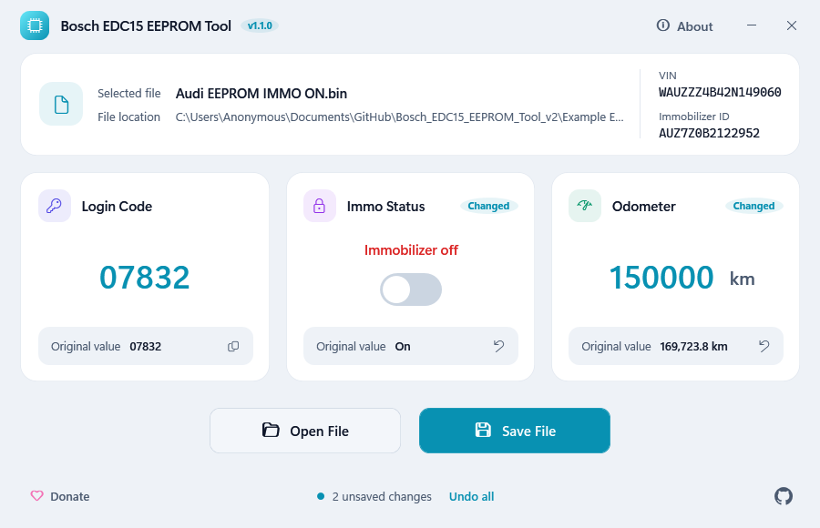
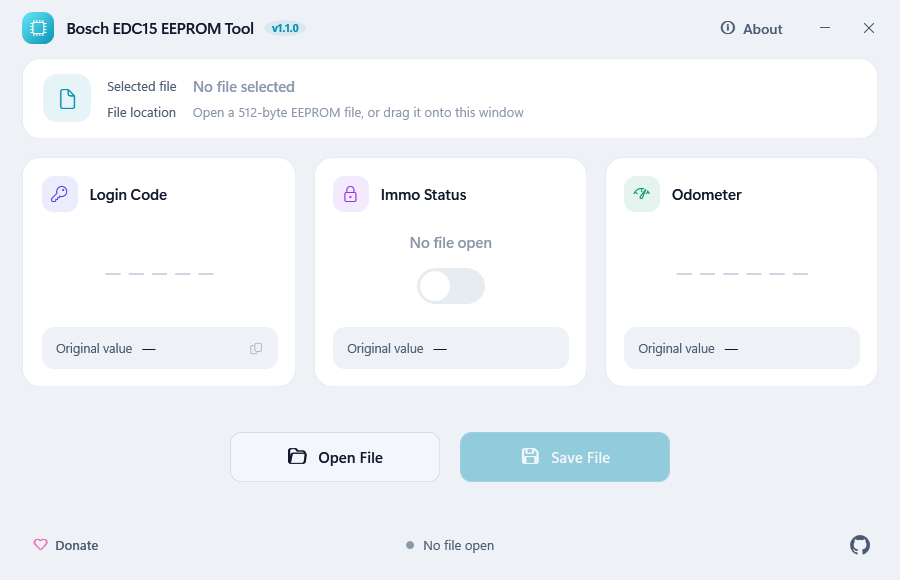
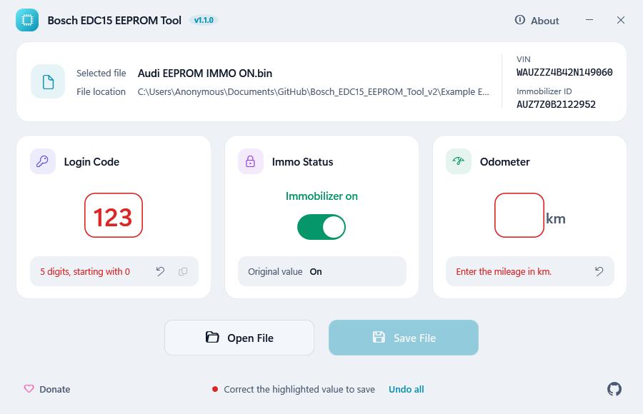
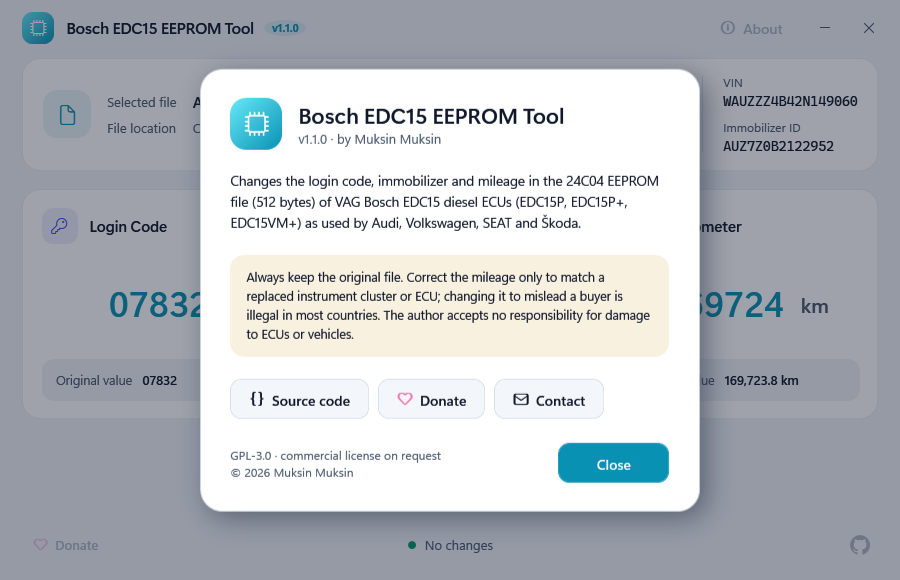

<a id="readme-top"></a>

<div align="center">



# Bosch EDC15 EEPROM Tool

**Read and edit the 24C04 EEPROM of Bosch EDC15 diesel ECUs — immobilizer, mileage and login code — in a clean desktop app.**<br>
A Windows tool for VAG (Audi, VW, SEAT, Škoda) EDC15 control units: switch the immobilizer on or off, read and correct the odometer, and read or change the 5-digit login/PIN code, all from a 512-byte `.bin` dump.

<p>
  <a href="https://github.com/muki01/Bosch_EDC15_EEPROM_Tool/stargazers"></a>
  <a href="https://github.com/muki01/Bosch_EDC15_EEPROM_Tool/network/members"></a>
  <a href="https://github.com/muki01/Bosch_EDC15_EEPROM_Tool/issues"></a>
  <a href="LICENSE"></a>
  <a href="https://github.com/muki01/Bosch_EDC15_EEPROM_Tool/releases"></a>
  <a href="https://github.com/muki01/Bosch_EDC15_EEPROM_Tool/actions/workflows/build.yml"></a>
</p>

<p>
  <a href="#-build-from-source"></a>
  <a href="#-build-from-source"></a>
  <a href="#-how-to-use"></a>
  <a href="#-compatible-ecus"></a>
</p>

**[Features](#-features)** · **[Screenshots](#-screenshots)** · **[Compatible ECUs](#-compatible-ecus)** · **[Build](#-build-from-source)** · **[How to Use](#-how-to-use)** · **[Custom Development](#-custom-development)**

</div>

---

## 📌 Overview

**Bosch EDC15 EEPROM Tool** opens a 512-byte 24C04 dump read from a **Bosch EDC15** engine control unit — the diesel ECU fitted to countless **Audi, VW, SEAT and Škoda** cars of the late 1990s and 2000s — and shows only what you need: the **immobilizer** state, the **mileage**, the **login/PIN code**, the **VIN** and the **immobilizer ID**. Change a value and the card marks it as changed; save and the tool writes a new `.bin`, so your original stays as it was.

No hex editing and no deep knowledge required. The byte offsets, the paired copies and the validation are handled for you, so a workshop can use it without understanding the dump layout.

<picture><source media="(prefers-color-scheme: dark)" srcset="images/screenshots/dark/edited.png"></picture>

## ✨ Features

- 🔐 **Immobilizer** — switch IMMO on or off with one toggle. Both immobilizer bytes are written together.
- 🔢 **Odometer** — read the stored mileage and correct it. Both copies are written, and the reserved bits in the field are preserved.
- 🔑 **Login/PIN code** — read the 5-digit code (`0XXXX`) for key programming and adaptations, copy it, or change it (both copies).
- 🚗 **Vehicle data** — shows the VIN and the immobilizer ID stored in the dump.
- 🏷️ **Clear changes** — every changed value is marked and can be restored on its own; **Undo all** restores everything.
- ✅ **Built-in checks** — files that are not 512 bytes are refused, and a warning appears only when something in the dump looks unusual (unrecognised immobilizer bytes, mismatched copies, an out-of-range code).
- ↩️ **Safe editing** — only the values you change are written, inputs are validated as you type, and the original file is never overwritten unless you choose it.
- 🌗 **Light and dark theme** — follows the Windows setting and switches instantly when you change it.
- 🖱️ **Fast to use** — drag and drop a dump onto the window, `Ctrl+O` to open, `Ctrl+S` to save, `F1` for information.

## 📸 Screenshots

<div align="center">
<sub>Screenshots switch between light and dark to match your GitHub theme. The program itself follows your Windows setting.</sub>
</div>

<table>
<tr>
<td align="center" width="50%">
<picture><source media="(prefers-color-scheme: dark)" srcset="images/screenshots/dark/start.png"></picture>
<br><b>Start</b><br><sub>Open a file or drag it onto the window</sub>
</td>
<td align="center" width="50%">
<picture><source media="(prefers-color-scheme: dark)" srcset="images/screenshots/dark/edited.png"></picture>
<br><b>Edit</b><br><sub>Changed values are marked and can be restored one by one</sub>
</td>
</tr>
<tr>
<td align="center">
<picture><source media="(prefers-color-scheme: dark)" srcset="images/screenshots/dark/invalid.png"></picture>
<br><b>Validation</b><br><sub>Wrong input is explained and saving stays off</sub>
</td>
<td align="center">
<picture><source media="(prefers-color-scheme: dark)" srcset="images/screenshots/dark/about.png"></picture>
<br><b>About</b><br><sub>What the tool does and what to keep in mind</sub>
</td>
</tr>
</table>

## 🎯 Compatible ECUs

The tool is built for **VAG EDC15 ECUs that use a 24C04 EEPROM** (512 bytes). On these units the immobilizer, mileage and login-code positions are the same, so one layout fits them all:

| | |
| :-- | :-- |
| **Manufacturer** | Bosch |
| **ECU family** | EDC15P, EDC15P+, EDC15VM+ (VAG variants) |
| **Vehicles** | Audi, Volkswagen, SEAT, Škoda |
| **Memory** | 24C04 serial EEPROM, 512 bytes |

> [!IMPORTANT]
> **How to tell if your dump fits.** The file must be exactly **512 bytes** (24C04). The tool refuses anything else. If the tool says the immobilizer setting is not recognised or the login code is not a valid `0XXXX` code, or shows the VIN as "Not found", the dump is probably from a different ECU layout — do not save it. EDC15 units that use a **95040 / 95080 / 95160** EEPROM, and non-VAG EDC15 ECUs (Renault, Volvo, Ford …), store these values differently and are **not** supported.

<details>
<summary><b>EEPROM layout (for the curious)</b></summary>

<br>

All offsets are inside the 512-byte dump. Every editable value is stored twice; the tool reads the first copy and writes both.

| Value | Primary | Mirror | Notes |
| :-- | :-- | :-- | :-- |
| Login / PIN code | `0x12E–0x12F` | `0x160–0x161` | little-endian; shown as `0XXXX` |
| Immobilizer | `0x1B0` | `0x1DE` | `0x73` = on, `0x60` = off |
| Odometer | `0x1BF–0x1C2` | `0x1ED–0x1F0` | 28-bit, value = km × 100; high nibble of the last byte is reserved |
| VIN | `0x140` | — | 17 ASCII characters, read-only |
| Immobilizer ID | `0x131` | — | 14 characters, read-only |

</details>

## 🛠️ Build from Source

Requirements: Windows with the [.NET SDK](https://dotnet.microsoft.com/download) 9 or newer, or Visual Studio 2022 (17.12+) with the *.NET desktop development* workload. The program targets **.NET Framework 4.8**, which is part of Windows 10 and 11, so users do not need to install anything.

```bash
git clone https://github.com/muki01/Bosch_EDC15_EEPROM_Tool.git
cd Bosch_EDC15_EEPROM_Tool

dotnet build -c Release          # build
dotnet test                      # run the unit tests
dotnet run --project src/Edc15EepromTool
```

Create the `.exe` for a release:

```bash
dotnet publish src/Edc15EepromTool -c Release -o publish
```

The result is `publish/EDC15 EEPROM Tool.exe`, a single file of about 110 KB that runs on its own.

### Project structure

```text
Bosch_EDC15_EEPROM_Tool/
├── src/Edc15EepromTool/
│   ├── Core/              Edc15Eeprom: reads and writes the dump (no UI code)
│   ├── ViewModels/        State and commands of the window (MVVM)
│   ├── Themes/            Light and dark palettes and control styles
│   └── MainWindow.xaml    The user interface
├── tests/                 Unit tests, checked against the example dumps
└── Example EEPROM Files/  Reference dumps
```

## 🚀 How to Use

1. **Open** — drop your 512-byte dump onto the window, or click **Open File**.
2. **Check** — read the immobilizer state, mileage, login code and vehicle data; a warning appears if anything looks unusual.
3. **Edit** — switch the immobilizer, type a new mileage or login code. Changed values are marked and can be restored one by one.
4. **Save** — click **Save File** to write the result to a new `.bin`.

## 🤝 Contributing

Contributions are welcome: tested ECU reports, bug reports, fixes and documentation improvements. Please read the **[Contributing Guide](CONTRIBUTING.md)** and the **[Code of Conduct](CODE_OF_CONDUCT.md)** first.

**Tested it on your ECU?** Open an [ECU report](https://github.com/muki01/Bosch_EDC15_EEPROM_Tool/issues/new/choose) with the Bosch part number and the vehicle. Please do not attach dumps publicly; they contain the VIN, immobilizer ID and login code of a real car. Security problems go to the **[Security Policy](SECURITY.md)**, not to a public issue.

## 🔗 Related Projects

This tool is part of a family of open-source automotive projects.

<table>
  <tr>
    <th colspan="3" align="left">Firmware — flash it and use it</th>
  </tr>
  <tr>
    <td width="30%"><a href="https://github.com/muki01/BMW_IBus_KBus"><b>BMW I-Bus / K-Bus Firmware</b></a></td>
    <td>Phone control and key-fob light functions for the BMW E46, on the ESP32 and Arduino.</td>
    <td width="118" align="center"><a href="https://github.com/muki01/BMW_IBus_KBus/stargazers"></a></td>
  </tr>
  <tr>
    <td width="30%"><a href="https://github.com/muki01/OBD2_K-line_Reader"><b>OBD2 K-Line Reader</b></a></td>
    <td>Scan tool for K-Line cars (ISO 9141-2, KWP2000) with a web dashboard, for the ESP32, ESP8266 and Arduino.</td>
    <td width="118" align="center"><a href="https://github.com/muki01/OBD2_K-line_Reader/stargazers"></a></td>
  </tr>
  <tr>
    <td width="30%"><a href="https://github.com/muki01/VAG_KW1281"><b>VAG KW1281</b></a></td>
    <td>KW1281 diagnostics for VW, Audi, Škoda and SEAT: ECU information, measuring groups and fault codes.</td>
    <td width="118" align="center"><a href="https://github.com/muki01/VAG_KW1281/stargazers"></a></td>
  </tr>
  <tr>
    <th colspan="3" align="left">Libraries — build your own firmware</th>
  </tr>
  <tr>
    <td width="30%"><a href="https://github.com/muki01/OBD2_KLine_Library"><b>OBD2 K-Line Library</b></a></td>
    <td>K-Line diagnostics behind one API: ISO 9141-2, KWP2000, KW1281, DS2 and KW82.</td>
    <td width="118" align="center"><a href="https://github.com/muki01/OBD2_KLine_Library/stargazers"></a></td>
  </tr>
  <tr>
    <td width="30%"><a href="https://github.com/muki01/OBD2_CAN_Bus_Library"><b>OBD2 CAN Bus Library</b></a></td>
    <td>OBD-II diagnostics over ISO 15765-4 with the ESP32's built-in CAN controller.</td>
    <td width="118" align="center"><a href="https://github.com/muki01/OBD2_CAN_Bus_Library/stargazers"></a></td>
  </tr>
  <tr>
    <th colspan="3" align="left">Tools</th>
  </tr>
  <tr>
    <td width="30%"><b>Bosch EDC15 EEPROM Tool</b><br><sub>you are here</sub></td>
    <td>Immobilizer, mileage and login code editor for the 24C04 EEPROM of Bosch EDC15 ECUs.</td>
    <td width="118" align="center"><a href="https://github.com/muki01/Bosch_EDC15_EEPROM_Tool/stargazers"></a></td>
  </tr>
</table>

## 💼 Custom Development

I design automotive diagnostic tools, firmware and hardware professionally. Whether you need a complete product or only the communication layer, I can help.

| Service | Details |
| :-- | :-- |
| **Protocol implementation** | BMW I/K-Bus, K-Line (ISO 9141-2 / KWP2000), CAN / UDS, VAG KW1281 and other manufacturer-specific protocols |
| **ECU communication & reverse engineering** | Bus sniffing, packet decoding, module control, EEPROM and flash layouts |
| **ECU security access** | Seed-key algorithms and unlock routines for KWP2000 / UDS |
| **Embedded firmware** | Arduino, ESP32, ESP8266, STM32, Raspberry Pi Pico |
| **Custom hardware** | Diagnostic dongles, shields and PCBs designed to your requirements |
| **Desktop & companion apps** | Windows, Android, iOS and web apps to read, log and edit vehicle data |

Have a project in mind? Reach out through the [Contact](#-contact) section below.

## 📬 Contact

For custom development, collaboration, sponsorship or ready-made devices:

| Channel | Address |
| :-- | :-- |
| 📧 **Email** | [muksin.muksin04@gmail.com](mailto:muksin.muksin04@gmail.com) |
| 💼 **LinkedIn** | [linkedin.com/in/muksin-muksin](https://www.linkedin.com/in/muksin-muksin/) |
| 🐙 **GitHub** | [@muki01](https://github.com/muki01) |

## ☕ Support the Project

If this project helped you, consider supporting its development:

<p>
  <a href="https://www.buymeacoffee.com/muki01"></a>
  <a href="https://www.paypal.com/donate/?hosted_button_id=SAAH5GHAH6T72"></a>
  <a href="https://github.com/sponsors/muki01"></a>
</p>

## 📈 Star History

<a href="https://star-history.com/#muki01/Bosch_EDC15_EEPROM_Tool&Date">
  <picture>
    <source media="(prefers-color-scheme: dark)" srcset="https://api.star-history.com/svg?repos=muki01/Bosch_EDC15_EEPROM_Tool&type=Date&theme=dark">
    
  </picture>
</a>

## ⚠️ Disclaimer

> [!WARNING]
> This tool is provided **as is**, for educational and vehicle-repair use. Editing ECU data carries risk and can leave a vehicle unable to start if done incorrectly. **Always keep a backup** of the original 512-byte dump. Correct the mileage only to match a replaced instrument cluster or ECU; changing it to misrepresent a vehicle is illegal in most countries. The author accepts no responsibility for damage to vehicles, ECUs or equipment.

## 📄 License

Released under the **[GNU General Public License v3.0](LICENSE)**.

- You are free to use, study, modify and share this tool.
- If you distribute it — on its own or as part of a product — you must make the complete source available under the same license.

**Closed-source or commercial product?** A separate commercial license is available. Get in touch through the [Contact](#-contact) section.

Copyright © 2026 Muksin Muksin.

---

<div align="center">

Created by [**Muki**](https://github.com/muki01) · If this project helped you, please give it a ⭐

<sub>Bosch EDC15 · 24C04 EEPROM · IMMO OFF · odometer · login code · PIN · VAG · Audi · VW · SEAT · Škoda · diesel ECU · WPF · .NET</sub>

**[⬆ Back to top](#readme-top)**

</div>
